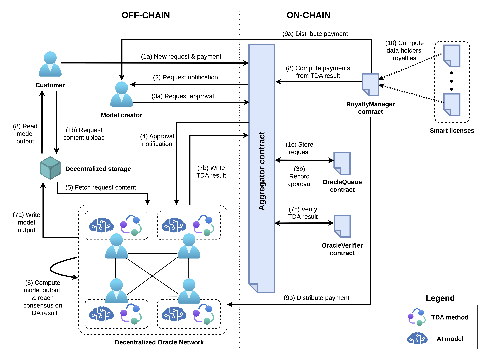

# Architecture

The following diagram illustrates the architecture of our fair, accurate, and trustworthy remuneration framework for AI model training data contributors.



## Entities and components

The system comprises on-chain and off-chain components that interact with each other to enable the automated computation and distribution of royalties to training data contributors. These are the main actors involved.

- The first actor is the **customer**, or **end user**, who issues a query, i.e., types a prompt, to the generative model and expects a response.
- The second actor is the **model creator**, or **model developer**, who uses copyrighted data made available by providers in order to train the model.
- The third actor is the set of **training data providers**, or **training data holders**, who hold copyright over the data they voluntarily supply to the model creator and expect to be remunerated for each end-user query that leverages their data. 
- The fourth actor is a **decentralized network of oracles** (i.e., a DON). This network comprises oracle nodes that, for each query from an end user, execute the model to obtain the output for the query. In addition, the nodes also run the training data attribution method, computing a vector that quantifies the influence of each training data point on the output. The DON reaches consensus on the attribution result and writes the result to the blockchain.

### Smart contracts

The on-chain components of the system are implemented as smart contracts. The main smart contracts are:

- ```Aggregator```: This contract contract is responsible for coordinating the interaction between the customer, model creator, and the DON. This is also the contract that locks funds received from the customer.

- ```OracleQueue```: This contract is responsible for storing and tracking the state of each query submitted by the customer.

- ```OracleVerifier```: This contract is responsible for verifying the integrity of the attribution result submitted by the DON.

- ```RoyaltyManager```: This contract is responsible for distributing the royalties to the model creator, the customer, and the training data providers.

## Workflow

1. (a) The customer submits a content generation request and a payment through the ```Aggregator``` contract. (b) The user request (i.e., a prompt for the model) is also uploaded to decentralized off-chain storage. (c) The ```Aggregator``` forwards the request to the ```OracleQueue``` contract, which stores it and tracks its state.

2. The ```Aggregator``` contract notifies the model creator of the newly submitted request.

3. (a) The model creator approves or rejects the request. (b) If approved, the request state is updated in the ```OracleQueue``` contract.

4. The approval notification is detected by the DON nodes.

5. The DON nodes fetch the user request content (i.e., the model prompt) from the decentralized off-chain storage.

6. Each oracle independently runs the AI model to generate the output and computes the training data attribution result. Then the oracles execute a distributed consensus protocol to reach a consensus on the attribution result.

7. (a) The DON oracles store the computed model output in the decentralized storage service. (b) Then they submit the training data attribution result on-chain via the ```Aggregator``` contract. (c) The ```Aggregator``` contract forwards the received result to the ```OracleVerifier``` contract for verification (i.e., signature check for an honest majority of oracles).

8. At this point, the ```Aggregator``` contract notifies the ```RoyaltyManager``` contract, which computes the royalty distribution based on the attribution result.

9. The ```RoyaltyManager``` contract distributes the payments to the model creator, the customer, and the training data providers.

10. The ```RoyaltyManager``` contract also invokes smart license agreements, if applicable. These can apply custom royalty logic.